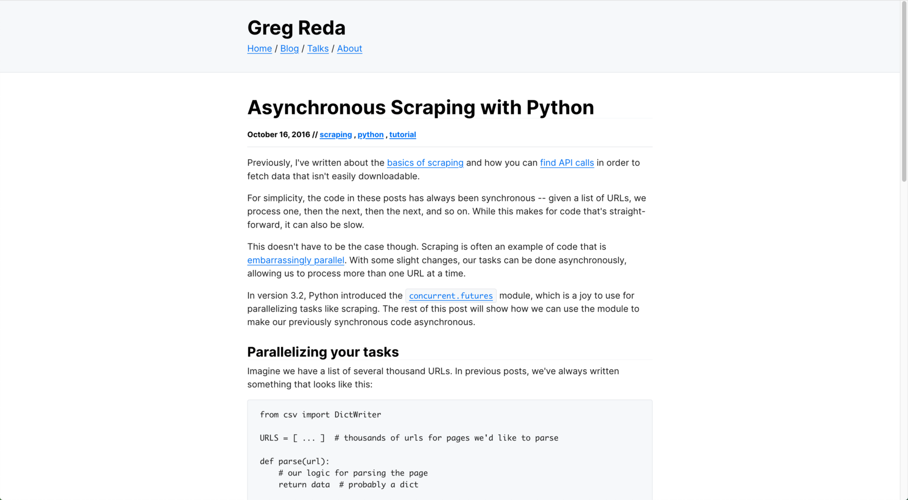

# newbird pelican theme

newbird is a theme for [Pelican](https://docs.getpelican.com/en/latest/), a static site generator written in Python. The theme relies heavily on [new.css](https://newcss.net/).

## Features
- Lightweight, using minimal CSS and Javascript, resulting in snappy page loads
- Google Analytics support via the `GOOGLE_ANALYTICS` variable
- [Twitter Cards](https://developer.twitter.com/en/docs/twitter-for-websites/cards/overview/abouts-cards) metadata for when articles are shared on Twitter
- [Facebook Open Graph](https://developers.facebook.com/docs/sharing/webmasters/) metadata for when articles are shared on Facebook
- Jupyter Notebooks are supported via the liquid tags plugin
- MathJax for adding mathematical notation into posts

## Notably Excluded Features
- This theme purposefully doesn't include social sharing buttons in order to keep it lightweight

## Getting Started
For a working example of this theme, see pelicanconf.py.

## Documentation
- `GOOGLE_ANALYTICS` to use Google Analytics, set this to your GA property id
- `TWITTER_CARDS` should be a boolean indicating whether or not you'd like Twitter Cards to be used when your links are shared on Twitter
- `TWITTER_NAME` should be your Twitter username. It is used to set the `author` metadata field for Twitter Cards.
- `LOGO_IMAGE` should be the path to your site's logo, which will be displayed in metadata when links are shared on social networks
- `FAVICON_IMAGE` should be the path to your site's favicon
- `INDEX_PAGE_HEADER` is the message you'd like displayed on your index page, above the site `DESCRIPTION`.
- `NAV_LINKS` is used for displaying the site's navigation bar. This variable should contain a list of dictionaries with each dictionary containing a `name` and `url` key: `NAV_LINKS = [{'name': 'Blog', 'url': '/blog/', ...}]`.
- `COPYRIGHT_START_YEAR` for displaying the site's copyright message in the footer

## Screenshots

### Index page

### Article page
